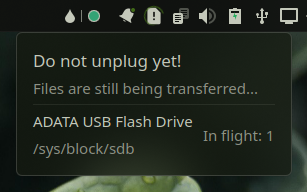
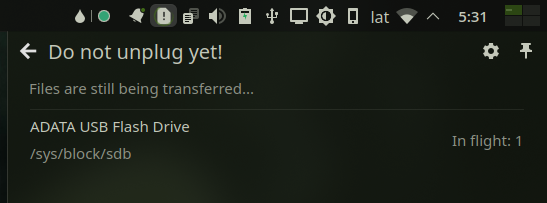

# Do not unplug yet

Simple Plasma Widget that shows/hides an icon when files are being transferred in the background to removable drives

**Why? TL;DR** Because even tough it may look like copy operations have already finished sometimes it does not, this is due to a OS feature called write caching, which copies the file to ram (very fast) and then to the drive at a lower (optimal) speed.

For some devices the second part is done in the background, this is why you sometimes can't remove the drive right after copying some files to it (specially with large ones)

For more detailed info check [this KDE Discuss post](https://discuss.kde.org/t/do-not-unplug-yet-files-are-still-being-transferred/5782)

## Screenshots



<details>
    <summary>More</summary>



</details>

## Installing

* Install widget from [KDE Store]([todo](https://store.kde.org/p/2096656)) or use `Get new widgets..`

### Manual install

* Install dependencies (please let me know if I missed or added something unnecessary)

  ```txt
    cmake extra-cmake-modules plasma-framework
  ```

* Install the plasmoid

  ```sh
  ./install.sh
  ```

## How does it work?

* Reads all removable devices from `/sys/block/<dev>/stat` and checks the 9th column value (in_flight)

> When files are copied to drives `in_flight` changes to non-zero value, then is set back to 0 by the kernel after the copy has truly finished

* This vehavior is then used to show/hide the widget and indicate which drive has pending operations

## Some notes

* I made this based on my understanding `/sys/block/<dev>/stat` which might not be completely accurate
* This has been tested with a couple of USB sticks and SD card

## Credits & Resources

* [Block layer statistics in /sys/block/`<dev>`/stat](https://www.kernel.org/doc/Documentation/block/stat.txt)
* [Google LLC. / Pictogrammers](https://pictogrammers.com/library/mdi/) panel icon
